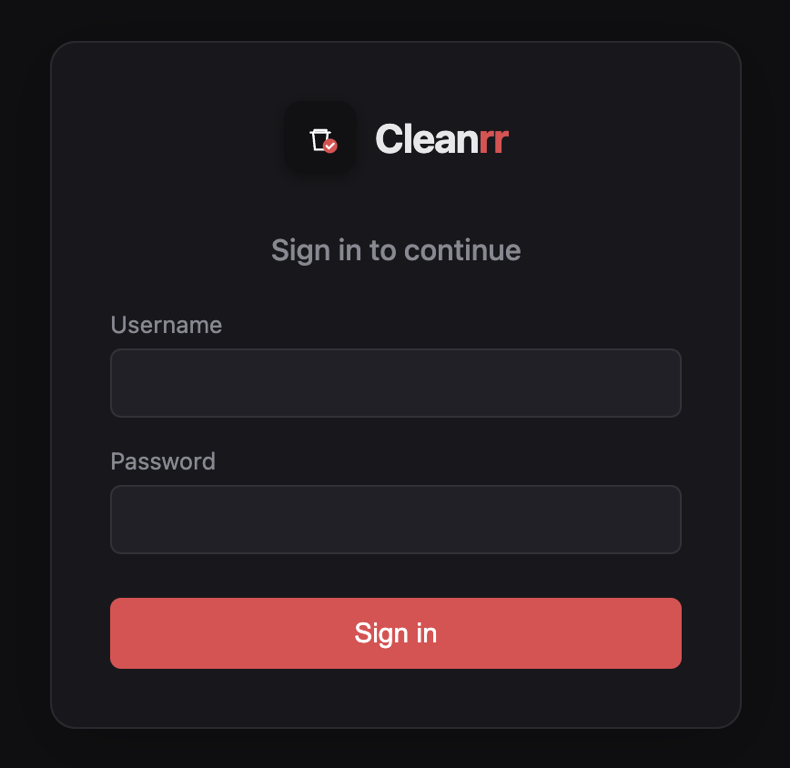
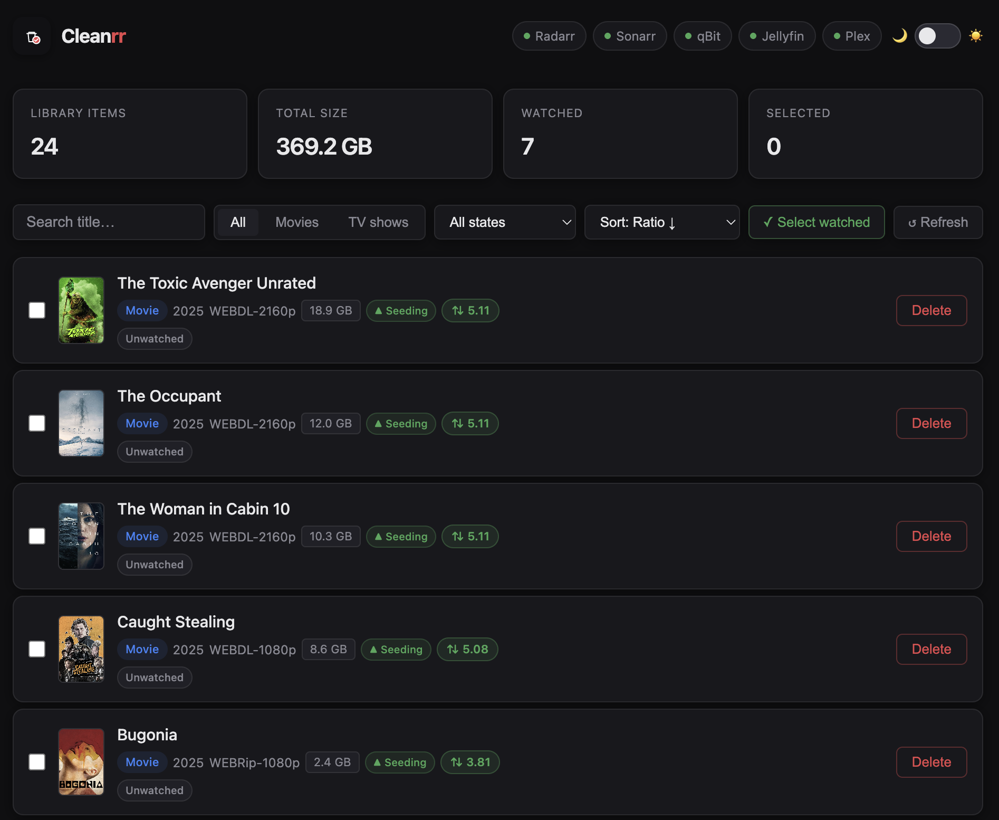
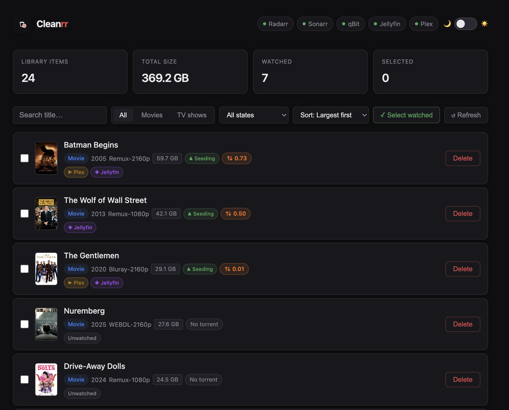
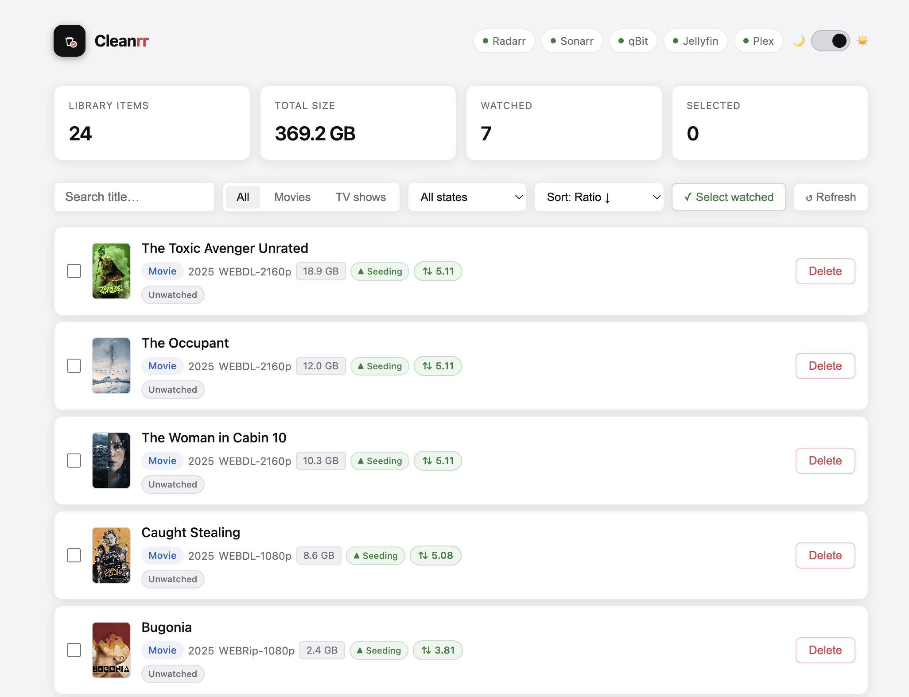
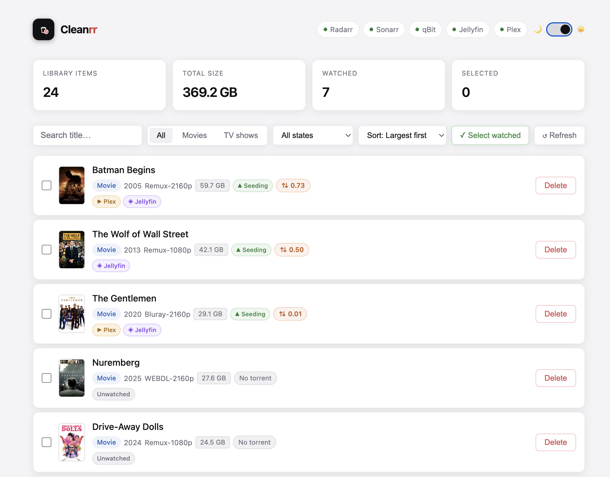

# Cleanrr

**One-click deletion for your self-hosted media stack.**

Remove movies and TV shows from Radarr, Sonarr, qBittorrent, and disk — all at once, from a single web UI running in Docker.

  

---








---

## The problem

Managing a self-hosted *arr stack means visiting four different apps every time you finish watching something — Radarr or Sonarr to remove the entry, qBittorrent to delete the torrent, and your file manager to clean up disk. Cleanrr does all of that in one click.

## Features

- Browse your full Radarr + Sonarr library in one place
- See **watched status** from Plex and Jellyfin side by side
- See **seeding ratio** per item — green ≥ 2.0, orange below 2.0
- See torrent **status** — Seeding, Stopped, or Downloading
- **One-click delete** — removes from Radarr/Sonarr, clears all matching torrents from qBittorrent, removes requests from Seerr, deletes files from disk
- **Bulk delete** — select multiple items and wipe them all at once
- **Select watched** — instantly selects everything you have already seen
- **Size breakdown** — clickable total size box shows Radarr, Sonarr, and qBittorrent sizes separately
- Sort by size, title, year, or ratio
- Filter by watched state
- **Login page** with secure session-based auth
- **Setup wizard** — first-run wizard to configure all services with live connection testing
- Dark and light mode with system preference detection
- Poster art pulled from Radarr/Sonarr

## Stack support

| App | What happens on delete |
|-----|----------------------|
| Radarr | Entry removed + files deleted from disk |
| Sonarr | Series removed + files deleted from disk |
| qBittorrent | All matching torrents removed + files deleted from `/downloads` |
| Seerr | All associated requests removed |
| Jellyfin | Watched status displayed (read-only) |
| Plex | Watched status displayed (read-only) |

---

## Quick start

### 1. Clone the repo

```bash
git clone https://github.com/QuantumNachos/cleanrr.git
cd cleanrr
```

### 2. Create your compose file

```bash
cp docker-compose.example.yml docker-compose.yml
```

Edit `docker-compose.yml` and set a `SESSION_SECRET`:

```bash
openssl rand -hex 32
```

### 3. Run it

```bash
docker compose up -d
```

Open `http://your-server-ip:3000` — you will be taken to the setup wizard on first run.

---

## Setup wizard

On first run Cleanrr redirects to a setup wizard where you:

1. Create your admin username and password
2. Configure Radarr, Sonarr, qBittorrent (all skippable)
3. Configure Jellyfin, Plex, Seerr (optional)

Each step has a **Test connection** button so you can verify before moving on. Everything is saved to `/config/cleanrr.json` which persists across container rebuilds via a Docker volume.

To reset and run the wizard again:
```bash
docker exec cleanrr rm /config/cleanrr.json
```

---

## Configuration guide

### Finding your server IP

```bash
hostname -I | awk '{print $1}'
```

**Never use `localhost`** inside Docker — containers can't reach the host via localhost. Always use the server's LAN IP or a Docker service name.

---

### Radarr

**API key:** Settings → General → API Key — **Default port:** `7878`

| Setup | URL |
|---|---|
| Same machine | `http://192.168.1.100:7878` |
| Same Docker Compose | `http://radarr:7878` |
| Behind reverse proxy | `http://192.168.1.100:7878` (internal port, not subdomain) |

---

### Sonarr

**API key:** Settings → General → API Key — **Default port:** `8989`

| Setup | URL |
|---|---|
| Same machine | `http://192.168.1.100:8989` |
| Same Docker Compose | `http://sonarr:8989` |
| Behind reverse proxy | `http://192.168.1.100:8989` (internal port) |

---

### qBittorrent

**Enable WebUI:** Tools → Web UI → enable — **Default port:** `8080`

| Setup | URL |
|---|---|
| Same machine | `http://192.168.1.100:8080` |
| Same Docker Compose | `http://qbittorrent:8080` |

---

### Jellyfin (optional)

**API key:** Dashboard → Advanced → API Keys → ✚ — **Default port:** `8096`

| Setup | URL |
|---|---|
| Same machine | `http://192.168.1.100:8096` |
| Same Docker Compose | `http://jellyfin:8096` |

---

### Plex (optional)

**Token:** Plex Web → any item → ··· → Get Info → View XML → find `X-Plex-Token=` in the URL — **Default port:** `32400`

| Setup | URL |
|---|---|
| Same machine | `http://192.168.1.100:32400` |
| Same Docker Compose | `http://plex:32400` |

---

### Seerr (optional)

**API key:** Settings → General → API Key — **Default port:** `5055`

| Setup | URL |
|---|---|
| Same machine | `http://192.168.1.100:5055` |
| Same Docker Compose | `http://seerr:5055` |

---

## Docker networking

If your *arr stack runs in a separate Docker network, uncomment the `networks` section in `docker-compose.yml`:

```yaml
services:
  cleanrr:
    networks:
      - arr-network

networks:
  arr-network:
    external: true
```

Run `docker network ls` to find your network name.

---

## How torrent matching works

qBittorrent stores files in a flat `/downloads` folder using release names like `House.of.Guinness.S01E01.2160p.WEB.h265-BETTY`. These never match the library paths Sonarr/Radarr use.

Cleanrr extracts the clean title from the release name by stripping resolution, source tags, season/episode markers, and group names — then matches against the Radarr/Sonarr title. For TV shows it finds **all** per-episode torrents and deletes them together in one batch call.

---

## Security

Designed for **local network use only** — do not expose port 3000 to the internet.

- Session-based auth with bcrypt password hashing
- Timing attack prevention on login (constant-time comparison + jitter delay)
- Security headers on every response (`X-Frame-Options`, `CSP`, `X-Content-Type-Options`)
- Rate limiting on all endpoints
- Input validation — usernames, URLs, sourceIds, torrent hashes all validated
- Batch delete capped at 100 items
- `maxRedirects: 0` on all outbound requests — prevents redirect-based SSRF
- Poster proxy restricted to jpeg/png/webp only
- Config file written with mode `0o600`
- Service URL sanitisation before saving to config
- Request body limited to 64kb

---

## Changelog

### v2.0.0
- Login page with secure session-based authentication
- 8-step first-run setup wizard with live connection testing
- Volume-backed config (`/config/cleanrr.json`) — survives rebuilds
- Seerr integration — removes requests on delete
- Expandable Total Size box showing per-app breakdown
- Fixed total size to correctly sum Radarr + Sonarr + qBittorrent
- All setup steps skippable except account creation
- Sign out button
- Full security hardening

### v1.0.0
- Initial release
- Radarr, Sonarr, qBittorrent, Jellyfin, Plex support
- One-click and bulk delete
- Ratio badges, watched status, poster art
- Dark and light mode
- Sort and filter

---

## Requirements

- Docker + Docker Compose
- Radarr and/or Sonarr (v3 API)
- qBittorrent with WebUI enabled
- Jellyfin, Plex, and/or Seerr (optional)

---

## License

MIT
